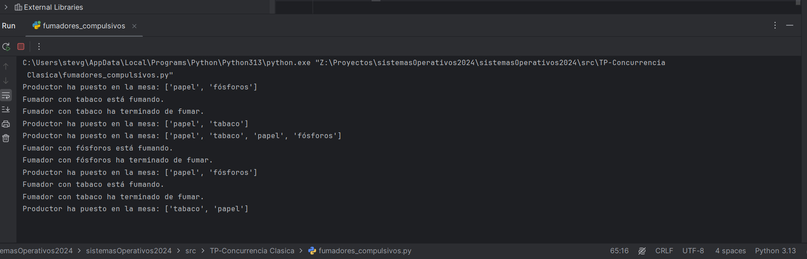

# Documentación del Problema de los Fumadores Compulsivos

## Descripción de los Mecanismos de Sincronización Empleados

| Mecanismo  | Descripción                                                                                                                                                      |
|------------|------------------------------------------------------------------------------------------------------------------------------------------------------------------|
| Semáforo   | `mutex`: Un semáforo binario (valor 1) que protege el acceso a la mesa, asegurando que solo un hilo pueda modificar los ingredientes en la mesa a la vez.      |
| Semáforo   | `semaphore`: Un semáforo inicializado en 0 que permite a los fumadores esperar hasta que haya ingredientes disponibles en la mesa.                             |

## Lógica de Negocio

| Paso | Descripción                                                                                     |
|------|-------------------------------------------------------------------------------------------------|
| 1    | El productor produce dos de los tres ingredientes y los coloca en la mesa.                    |
| 2    | Los fumadores esperan a que haya ingredientes en la mesa. Cuando están disponibles, el fumador correspondiente fuma y limpia la mesa. |
| 3    | Este ciclo se repite indefinidamente.                                                           |

## Identificación del Estado Compartido

| Variable                | Descripción                                                                                           |
|------------------------|-------------------------------------------------------------------------------------------------------|
| `ingredients_on_table` | Lista que contiene los ingredientes actualmente en la mesa. Puede contener hasta dos de los siguientes: `TABACCO`, `PAPER`, `MATCHES`. |

## Descripción Algorítmica del Avance de Cada Hilo/Proceso

| Hilo/Proceso | Descripción                                                                                                 |
|--------------|-------------------------------------------------------------------------------------------------------------|
| Productor    | 1. Espera un tiempo aleatorio simulado (1-3 segundos). <br> 2. Produce dos ingredientes aleatorios. <br> 3. Coloca los ingredientes en la mesa y notifica a los fumadores. <br> 4. Libera el semáforo `mutex`. |
| Fumador      | 1. Espera a que el semáforo `semaphore` indique que hay ingredientes en la mesa. <br> 2. Comprueba si puede fumar. <br> 3. Si puede, simula el tiempo de fumar (0.5-1.5 segundos). <br> 4. Limpia la mesa y libera el semáforo `mutex`. |
| Interacción   | 1. El productor produce ingredientes y los coloca en la mesa. <br> 2. Los fumadores reaccionan cuando hay ingredientes. <br> 3. `mutex` asegura que solo un hilo acceda a la mesa a la vez. |

## Descripción del Entorno de Desarrollo

| Elemento              | Descripción                                                                                           |
|----------------------|-------------------------------------------------------------------------------------------------------|
| Código Fuente        | ```python                                                                                           |
|                      | import threading                                                                                     |
|                      | import random                                                                                        |
|                      | import time                                                                                          |
|                      |                                                                                                     |
|                      | # Semáforos y variables compartidas                                                                  |
|                      | mutex = threading.Semaphore(1)                                                                       |
|                      | ingredients_on_table = []                                                                             |
|                      | semaphore = threading.Semaphore(0)                                                                    |
|                      |                                                                                                     |
|                      | TABACCO = 'tabaco'                                                                                   |
|                      | PAPER = 'papel'                                                                                      |
|                      | MATCHES = 'fósforos'                                                                                 |
|                      |                                                                                                     |
|                      | class Smoker(threading.Thread):                                                                       |
|                      |     def __init__(self, ingredient):                                                                  |
|                      |         super().__init__()                                                                           |
|                      |         self.ingredient = ingredient                                                                  |
|                      |                                                                                                     |
|                      |     def run(self):                                                                                   |
|                      |         while True:                                                                                  |
|                      |             semaphore.acquire()                                                                       |
|                      |             if (self.ingredient == TABACCO and PAPER in ingredients_on_table and MATCHES in ingredients_on_table) or \ |
|                      |                (self.ingredient == PAPER and TABACCO in ingredients_on_table and MATCHES in ingredients_on_table) or \ |
|                      |                (self.ingredient == MATCHES and TABACCO in ingredients_on_table and PAPER in ingredients_on_table): |
|                      |                 print(f'Fumador con {self.ingredient} está fumando.')                               |
|                      |                 time.sleep(random.uniform(0.5, 1.5))                                               |
|                      |                 print(f'Fumador con {self.ingredient} ha terminado de fumar.')                      |
|                      |                 ingredients_on_table.clear()                                                         |
|                      |                 mutex.release()                                                                       |
|                      |                                                                                                     |
|                      | class Producer(threading.Thread):                                                                    |
|                      |     def run(self):                                                                                   |
|                      |         while True:                                                                                  |
|                      |             time.sleep(random.uniform(1, 3))                                                        |
|                      |             ingredients = [TABACCO, PAPER, MATCHES]                                                 |
|                      |             random.shuffle(ingredients)                                                               |
|                      |             ingredients_on_table.extend(ingredients[:2])                                            |
|                      |             print(f'Productor ha puesto en la mesa: {ingredients_on_table}')                        |
|                      |             semaphore.release()                                                                       |
|                      |             mutex.acquire()                                                                          |
|                      |                                                                                                     |
|                      | smokers = [Smoker(TABACCO), Smoker(PAPER), Smoker(MATCHES)]                                        |
|                      | producer = Producer()                                                                                 |
|                      |                                                                                                     |
|                      | producer.start()                                                                                      |
|                      | for smoker in smokers:                                                                                |
|                      |     smoker.start()                                                                                    |
|                      |                                                                                                     |
|                      | for smoker in smokers:                                                                                |
|                      |     smoker.join()                                                                                    |
|                      | producer.join()                                                                                      |
|                      | ```                                                                                                  |
| Lenguaje            | Python                                                                                               |
| Versión             | Python 3.8 o superior                                                                                 |
| Bibliotecas         | `threading` y `random` (bibliotecas estándar de Python).                                            |

## Sistema Operativo

| Elemento            | Descripción               |
|---------------------|---------------------------|
| Desarrollo y Pruebas| Ubuntu 20.04 LTS         |

## Ejemplos de Ejecución Exitosa

Ejemplo de salida en consola:

